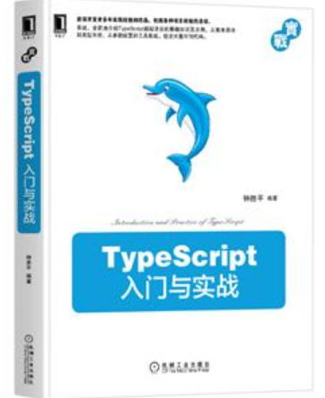

# 前言

> Repo: https://github.com/zhongsp/TypeScript

该工程是对 TypeScript 官方及开源社区书写的编程手册、版本发布说明等综合内容的中文翻译。
感谢 Microsoft 和开源社区的工程师们的工作，为 JavaScript 开发带来了全新的体验！

这个项目是我在 2015 年创建的，没想到已经维护快 7 年了，它已然是我参与过的时间最长的项目。
在 2015 年之前，我都是在使用 JavaScript 语言，主要参与的项目也大都是采用 AngularJS 框架的项目，没有接触过 TypeScript。
那时候，TypeScript 在国内项目里用的好像不多，但是在国外已经有不少项目开始采用这个新技术。
2015 年，我正好参与了一个和国外一起合作的项目，决定使用 TypeScript 1.x。
也正因为这个机会，我开始了 TypeScript 的学习。
学习没多久，我就喜欢上了这个语言，并且确信这个东西一定能火。
因为作为一个多年的 JavaScript 程序员来讲，我很清楚它解决了多少痛点（必须得把 VS Code 一起代上）。

早些时候，TypeScript 的文档也不多。
原因之一，TypeScript 是 JavaScript 的超集，JavaScript 的知识点已经有足够的资料了，TypeScript 一笔代过。
原因之二，早期的 TypeScript 里特性不多，知识点不多。原因之三，它的文档相较于做的好的语言来讲确实较弱，可能没什么专门的团队负责，或者没有专职的 technical writer 去写作。
于是，我决定边学边翻译，一方面为了自己，另一方面为了其它小伙伴。

## 哪些内容会继续更新？

我会继续翻译 TypeScript 新版本的 Release Notes。

## 哪些内容可能不会继续更新？

这个项目中的 Handbook 是翻译老版本的 Handbook。
TypeScript 官网大约从 2020 年开始要打造新版的官网，其中包括官网的样式，以及要重写大部分的文档。
目前，我不打算再翻译一遍新版的 Handbook。
我看了下新版的手册，确实优化了不少，但也不代表老版本是无用的或错误的。

现在，TypeScript 官网也开始支持国际化了，已经有部分文档翻译成了中文，我之前还翻译了一篇。
本着开源和为社区服务的精神，推荐学有余力的同学直接给官网提交翻译的 Pull Reuqest，造福开发者。

## 关于《TypeScript入门与实战》一书

因为长期维护 TypeScript 更新的内容再加上在项目中一直使用 TypeScript，
所以有机会将知识进行梳理总结成书。

我出版了《TypeScript入门与实战》一书。

在该书中，尝试着尽可能完整地介绍TypeScript语言的基础知识，并结合了一些本人的使用经验和体会。
它主要面向的是TypeScript语言的初级和中级使用者。
本人还处于TypeScript语言的学习阶段，可能存在理解错误的地方，还请大家指正，一起进步。
但需要强调的是，本书不是对 Handbook 的翻译。

## 感谢

在过去的七年中，有很多素不相识、极富开源精神的小伙伴们曾参与到本工程的翻译与校对工作中。
对你们表示感谢！同时也欢迎其它任何想参与到该工程中的朋友们，贡献你们的力量！
