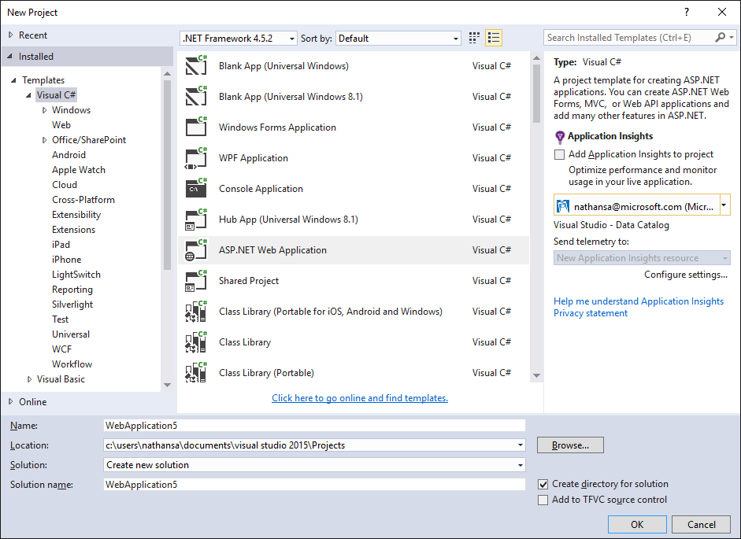

# ASP.NET 4

## 安装 TypeScript

如果你使用的 Visual Studio 版本还不支持 TypeScript， 你可以安装 [Visual Studio 2015](http://www.microsoft.com/en-us/download/details.aspx?id=48593) 或者 [Visual Studio 2013](https://www.microsoft.com/en-us/download/details.aspx?id=48739)。
这个快速上手指南使用的是 Visual Studio 2015。

## 新建项目

1. 选择 **File**
2. 选择 **New Project**
3. 选择 **Visual C#**
4. 选择 **ASP.NET Web Application**

   

5. 选择 **MVC**

    取消复选 "Host in the cloud" 本指南将使用一个本地示例。
    

运行此应用以确保它能正常工作。

# 添加 TypeScript

下一步我们为 TypeScript 添加一个文件夹。


将文件夹命名为 src。


## 添加 TypeScript 代码

在 `src` 上右击并选择 **New Item**。
接着选择 **TypeScript File** 并将此文件命名为 `app.ts`。


## 添加示例代码

将以下代码写入 `app.ts` 文件。

```ts
function sayHello() {
    const compiler = (document.getElementById("compiler") as HTMLInputElement).value;
    const framework = (document.getElementById("framework") as HTMLInputElement).value;
    return `Hello from ${compiler} and ${framework}!`;
}
```

## 构建设置

右击项目并选择 **New Item**。
接着选择 **TypeScript Configuration File** 保持文件的默认名字为 `tsconfig.json`。


将默认的 `tsconfig.json` 内容改为如下所示：

```json
{
  "compilerOptions": {
    "noImplicitAny": true,
    "noEmitOnError": true,
    "sourceMap": true,
    "target": "es5",
    "outDir": "./Scripts/App"
  },
  "files": [
    "./src/app.ts",
  ],
  "compileOnSave": true
}
```

看起来和默认的设置差不多，但注意以下不同之处：

1. 设置 `"noImplicitAny": true`。
2. 特别是这里 `"outDir": "./Scripts/App"`。
3. 显式列出了 `"files"` 而不是依据 `"excludes"`选项。
4. 设置 `"compileOnSave": true`。

当你写新代码时，设置 `"noImplicitAny"` 选项是个好主意 &mdash; 这可以确保你不会错写任何新的类型。
设置 `"compileOnSave"` 选项可以确保你在运行web程序前自动编译保存变更后的代码。
更多信息请参见 [the tsconfig.json documentation](../tsconfig.json.md)。

## 在视图中调用脚本

1. 在 **Solution Explorer** 中, 打开 **Views** | **Home** | `Index.cshtml`。

   

2. 修改代码如下：

   ```html
   @{
       ViewBag.Title = "Home Page";
   }
   <script src="~/Scripts/App/app.js"></script>
   <div id="message"></div>
   <div>
       Compiler: <input id="compiler" value="TypeScript" onkeyup="document.getElementById('message').innerText = sayHello()" /><br />
       Framework: <input id="framework" value="ASP.NET" onkeyup="document.getElementById('message').innerText = sayHello()" />
   </div>
   ```

## 测试

1. 运行项目。
2. 在输入框中键入时，您应该看到一个消息：


## 调试

1. 在 Edge 浏览器中, 按 F12 键并选择 **Debugger** 标签页。
2. 展开 localhost 列表, 选择 src/app.ts
3. 在 `return` 那一行上打一个断点。
4. 在输入框中键入一些内容，确认TypeScript代码命中断点，观察它是否能正确地工作。


这就是你需要知道的在ASP.NET中使用TypeScript的基本知识了。接下来，我们引入Angular，写一个简单的Angular程序示例。

# 添加 Angular 2

## 使用 NPM 下载所需的包

1. 安装 [PackageInstaller](https://github.com/madskristensen/PackageInstaller)。

2. 用 PackageInstaller 来安装 Angular 2， systemjs 和 Typings。

   在project上右击, 选择 **Quick Install Package**。

   
   
   

3. 用 PackageInstaller 安装 es6-shim 的类型文件。

   Angular 2 包含 es6-shim 以提供 Promise 支持, 但 TypeScript 还需要它的类型文件。
   在 PackageInstaller 中, 选择 Typing 替换 npm 选项。接着键入 "es6-shim"：

   

## 更新 tsconfig.json

现在安装好了 Angular 2 及其依赖项， 我们还需要启用 TypeScript 中实验性的装饰器支持并且引入 es6-shim 的类型文件。
将来的版本中，装饰器和 ES6 选项将成为默认选项，我们就可以不做此设置了。添加
`"experimentalDecorators": true, "emitDecoratorMetadata": true` 选项到 `"compilerOptions"` 选项段， 添加 `"./typings/main.d.ts"` 到 `"files"` 选项段。
最后，我们还将要创建新的代码文件 `"./src/model.ts"`、`"./src/main.ts"` ，也将它们添加到 `"files"` 中，现在 tsconfig 看起来像这样：

```json
{
  "compilerOptions": {
    "noImplicitAny": false,
    "noEmitOnError": true,
    "sourceMap": true,
    "target": "es5",
    "experimentalDecorators": true,
    "emitDecoratorMetadata": true,
    "outDir": "./Scripts/App"
  },
  "files": [
    "./src/app.ts",
    "./src/model.ts",
    "./src/main.ts",
    "./typings/main.d.ts"
  ]
}
```

## 添加 CopyFiles 到 build 中

最后，我们需要确保 Angular 文件作为 build 的一部分复制进来。这样操作，右击项目选择 'Unload' ，再次右击项目选择
 'Edit csproj'。
在 TypeScript 配置项 PropertyGroup 之后，添加一个 ItemGroup 和 Target 配置项来复制 Angular 文件。

```xml
<ItemGroup>
  <NodeLib Include="$(MSBuildProjectDirectory)\node_modules\angular2\bundles\angular2.js"/>
  <NodeLib Include="$(MSBuildProjectDirectory)\node_modules\angular2\bundles\angular2-polyfills.js"/>
  <NodeLib Include="$(MSBuildProjectDirectory)\node_modules\systemjs\dist\system.src.js"/>
  <NodeLib Include="$(MSBuildProjectDirectory)\node_modules\rxjs\bundles\Rx.js"/>
</ItemGroup>
<Target Name="CopyFiles" BeforeTargets="Build">
  <Copy SourceFiles="@(NodeLib)" DestinationFolder="$(MSBuildProjectDirectory)\Scripts"/>
</Target>
```

现在，右击 project 选择重新加载项目。
此时应当能在 Solution Explorer 中看到 node_modules。

## 用 TypeScript 写一个简单的 Angular 应用

首先，将 `app.ts` 改成：

```ts
import {Component} from "angular2/core"
import {MyModel} from "./model"

@Component({
    selector: `my-app`,
    template: `<div>Hello from {{getCompiler()}}</div>`
})
class MyApp {
    model = new MyModel();
    getCompiler() {
        return this.model.compiler;
    }
}
```

接着在 `src` 中添加 TypeScript 文件 `model.ts`:

```ts
export class MyModel {
    compiler = "TypeScript";
}
```

再在 `src` 中添加 `main.ts`：

```ts
import {bootstrap} from "angular2/platform/browser";
import {MyApp} from "./app";
bootstrap(MyApp);
```

最后，将 `Views/Home/Index.cshtml` 改成：

```html
@{
    ViewBag.Title = "Home Page";
}
<script src="~/Scripts/angular2-polyfills.js"></script>
<script src="~/Scripts/system.src.js"></script>
<script src="~/Scripts/rx.js"></script>
<script src="~/Scripts/angular2.js"></script>
<script>
    System.config({
        packages: {
            '/Scripts/App': {
                format: 'cjs',
                defaultExtension: 'js'
            }
        }
    });
    System.import('/Scripts/App/main').then(null, console.error.bind(console));
</script>
<my-app>Loading...</my-app>
```

这里加载了此应用。
运行 ASP.NET 应用，你应该能看到一个 div 显示 "Loading..." 紧接着更新成显示 "Hello from TypeScript"。
